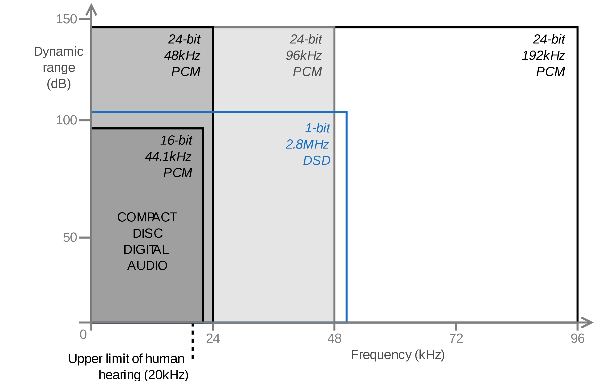

# CPE 487 DSD Final Project Ideas

## IDEA 1: Gravity Simulator

### Objective:

To modify the lab-provided files in this course to add a gravity-simulating feature, as well as collisions between objects.

### Methods:

### Current Bottlenecks:

### Further Exploration:

## IDEA 2: DSD Decoder to PCM Encoder

### Background:

Analogue audio needs to be encoded into a digital format to be stored, read, and edited on modern computers. The most common encoding style in modern systems is pulse-code modulation (PCM), which quantises analogue signals into discrete binary codes, played at a certain sampling frequency. Standard-definition audio uses 16-bit, 44100 Hz PCM, which is the standard used in the original Compact Disc Digital Audio, or CD, while high-resolution audio formats use at least 24 bits and much higher sampling frequencies. 

However, there exist several competing formats for encoding digital audio, the most interesting being Direct Stream Digital (DSD), a format meant to replace and surpass the audio capabilities of the original CD. DSD employs a sigma-delta modulator to encode an analogue audio signal into a 1-bit stream, played at a much higher sampling frequency than standard PCM audio. The most common DSD frequency is DSD64, or 64 times 44.1kHz. There are claims that DSD sounds better than standard or even high-definition PCM audio, although usage of DSD has been limited due to the relative complexity of recording, encoding, processing, and playing DSD files relative to PCM.

### Objective:

To decode a sound file encoding in DSD64, or 1-bit, 2.8224 MHz PDM, and ultimately encode the audio into 16-bit, 44.1 kHz PCM.

### Methods:

The idea, as of this moment, is to have the Nexys-7 board decode the DSD64 file, which it theoretically should be capable of. This will likely be by decoding the original file into an analogue sound again. Then, the analogue output of the DSD decoder will be encoded into 16-bit PCM, which the board should also be capable of. 

It may be possible to decode the PDM file into a PCM file directly without an intermediate analogue phase, which is preferable as it reduces the amount of processing that the sound file undergoes.

### Current Bottlenecks:

- [x] Determine the general parametres of the project
- [x] Research PDM and PCM formats, especially the structure of a sigma-delta modulator
- [x] Acquire a sample of a PDM file for processing
- [ ] Determine the capabilities of the Nexys-7 board for signal decoding and encoding
- [ ] Examine the steps necessary to connect the decoding stage, the analogue stage, and the encoding stage
- [ ] Determine the structure of the DSD64 file, especially whether it contains an uncompressed 1-bit audio stream or not

### Further Exploration:

